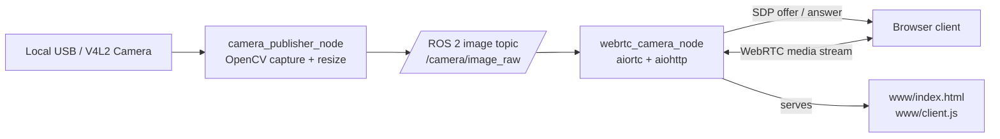

# video_streaming

## Introduction
`video_streaming` is a ROS 2 package for low-latency camera streaming to web browsers using WebRTC.

It supports two deployment modes:
- **Single-container mode**: ROS camera publisher and WebRTC server run together in one container
- **Native ROS 2 mode**: ROS nodes run directly in your workspace

Current integration path:
- **No GStreamer is used in the live pipeline**
- Camera capture is handled by OpenCV in `camera_publisher_node`
- Frame transport between ROS nodes uses a ROS 2 image topic
- Browser streaming is handled by `webrtc_camera_node` using `aiortc` and `aiohttp`

What it does:
- Captures frames from a local camera with `camera_publisher_node`
- Publishes the frames on a ROS 2 topic such as `/camera/image_raw`
- Subscribes to that ROS topic in `webrtc_camera_node`
- Serves a WebRTC web app on port `8080`
- Supports multiple browser clients

## Solution Overview



Integration notes:
- `camera_publisher_node` reads from `/dev/video*`, converts the frames to ROS `sensor_msgs/Image`, and publishes them on the configured topic.
- `webrtc_camera_node` subscribes to that topic, converts ROS images back into OpenCV frames, and hands them to the WebRTC track.
- `www/client.js` creates the browser peer connection, posts the SDP offer to `/offer`, and attaches the incoming stream to the video element.
- The server also hosts the static browser app from `video_streaming/www`.

## Quick-Start

### A) Run natively (ROS 2 workspace)
From your ROS 2 workspace root (`/home/giangnh101/ros_ws`):

```bash
colcon build --packages-select video_streaming
source install/setup.bash
ros2 launch video_streaming stream_only.launch.py
```

This starts both ROS nodes:
- `camera_publisher_node` publishes camera frames to `/camera/image_raw`
- `webrtc_camera_node` subscribes to that topic and serves WebRTC

Open in browser:
- `http://localhost:8080` (same machine)
- `http://<your-lan-ip>:8080` (phone/another device on same network)

### B) Run with Docker
From `/home/giangnh101/ros_ws/src/video_streaming`:

```bash
chmod +x docker/build_image.sh docker/run_container.sh docker/entrypoint.sh
./docker/build_image.sh
./docker/run_container.sh
```

Open in browser:
- `http://localhost:8080`
- `http://<your-lan-ip>:8080`

Note:
- This is the recommended single-container mode.
- The container runs both ROS nodes and the SPA assets stay separate in `video_streaming/www`.

Useful Docker overrides:

```bash
CAMERA_DEVICE=/dev/video2 HOST_PORT=8090 WIDTH=640 HEIGHT=360 FPS=15 ./docker/run_container.sh
```

## Prerequisites
- ROS 2 Humble (for native run)
- Linux camera device (default `/dev/video0`)
- Docker (for container run)
- Browser with WebRTC support

## Configuration
Default launch/runtime values:
- `host=0.0.0.0`
- `port=8080`
- `camera_index=0`
- `image_topic=/camera/image_raw`
- `width=640`
- `height=360`
- `fps=15`

Native launch override example:

```bash
ros2 launch video_streaming stream_only.launch.py width:=1280 height:=720 fps:=20 camera_index:=0
```

## Troubleshooting
- **Camera not found / cannot open camera**
	- Check device exists: `ls -l /dev/video*`
	- Use correct camera index or device (`camera_index:=...` or `CAMERA_DEVICE=/dev/videoX`)
	- Ensure no other app is locking the camera

- **Browser page opens but no stream**
	- Click **Start** on the web page to begin WebRTC negotiation
	- Check node logs for camera errors
	- Try a lower load: `width:=640 height:=360 fps:=12`
	- Confirm `camera_publisher_node` and `webrtc_camera_node` are both running

- **Cannot access from phone / another PC**
	- Use `http://<your-lan-ip>:8080` (not `localhost`)
	- Ensure both devices are on the same network
	- Allow inbound TCP port `8080` in firewall

- **Docker container starts but browser cannot connect**
	- Prefer host networking: `USE_HOST_NETWORK=1 ./docker/run_container.sh`
	- If not using host networking, ensure port mapping is set (`HOST_PORT`)
