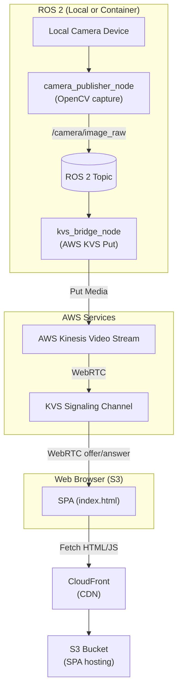

# AWS Kinesis Video Streams Branch

This branch implements camera streaming via **AWS Kinesis Video Streams** with a separate single-page app deployed to S3.

## Project Structure

```
video_streaming/
├── ros2_nodes/                    # ROS 2 nodes for camera capture
│   ├── camera_publisher_node.py   # Captures frames from V4L2 camera
│   └── kvs_bridge_node.py         # Bridges frames to AWS KVS (NEW)
│
├── spa/                           # Single-page app (separate deployment)
│   ├── index.html                 # Main HTML
│   ├── client.js                  # WebRTC client logic
│   ├── styles.css                 # UI styles
│   ├── package.json               # Dependencies
│   └── deploy.sh                  # S3 deployment script
│
├── cdk/                           # AWS CDK infrastructure as code
│   ├── app.py                     # Main CDK app
│   ├── cdk.json                   # CDK configuration
│   ├── requirements.txt           # Python dependencies
│   └── stacks/
│       ├── kvs_stack.py           # Kinesis Video Stream resources
│       ├── s3_spa_stack.py        # S3 bucket + CloudFront
│       └── iam_stack.py           # IAM roles for ROS2 nodes
│
├── IMPLEMENTATION.md              # Original implementation guide
└── README.md                      # This file
```

## Architecture



## Deployment Steps

### Prerequisites

- AWS account with appropriate credentials configured
- Python 3.8+ with pip
- Node.js 14+ (optional, for SPA testing)
- ROS 2 Humble on local machine or Docker container
- AWS CLI v2 installed

### 1. Deploy Infrastructure with CDK

```bash
cd cdk

# Install Python dependencies
pip install -r requirements.txt

# Configure context variables (optional)
export CDK_STREAM_NAME="ros2-camera-stream"
export CDK_BUCKET_NAME="ros2-camera-app"
export CDK_REGION="us-east-1"

# Deploy stacks
cdk deploy --all

# Note the outputs (stream name, S3 bucket, CloudFront URL)
```

### 2. Deploy SPA to S3

```bash
cd ../spa

# Deploy using script
bash deploy.sh ros2-camera-app us-east-1

# Or manually with AWS CLI
aws s3 sync . s3://ros2-camera-app --exclude ".git/*" --region us-east-1
```

### 3. Run ROS2 Camera Nodes

Update `launch/kvs_stream.launch.py` (create if needed) or run directly:

```bash
# Terminal 1: Camera publisher
ros2 run video_streaming camera_publisher_node \
  --camera-index 0 \
  --width 640 \
  --height 360 \
  --fps 15

# Terminal 2: KVS bridge (requires AWS credentials)
export AWS_ACCESS_KEY_ID="your-key"
export AWS_SECRET_ACCESS_KEY="your-secret"

ros2 run video_streaming kvs_bridge_node \
  --image-topic /camera/image_raw \
  --stream-name ros2-camera-stream \
  --aws-region us-east-1
```

Or use a launch file:

```bash
ros2 launch video_streaming kvs_stream.launch.py
```

### 4. View Stream in Browser

Navigate to the SPA URL from CDK output:
- **With CloudFront:** `https://<distribution>.cloudfront.net`
- **Direct S3:** `http://ros2-camera-app.s3-website-us-east-1.amazonaws.com`

1. Enter stream name: `ros2-camera-stream`
2. Enter AWS region: `us-east-1`
3. Click **Connect**

## Configuration

### KVS Bridge Node Parameters

```bash
ros2 run video_streaming kvs_bridge_node --help

--image-topic       Topic to subscribe to (default: /camera/image_raw)
--stream-name       KVS stream name (default: ros2-camera-stream)
--aws-region        AWS region (default: us-east-1)
--width             Frame width (default: 640)
--height            Frame height (default: 360)
--fps               Frames per second (default: 15)
```

### CDK Configuration (cdk/cdk.json)

```json
{
  "context": {
    "streamName": "ros2-camera-stream",
    "bucketName": "ros2-camera-kvs-app",
    "enableCloudFront": true,
    "region": "us-east-1"
  }
}
```

## AWS Services Used

| Service | Purpose |
|---------|---------|
| **Kinesis Video Streams** | Ingest and buffer camera frames |
| **KVS Signaling** | Negotiate WebRTC connections |
| **S3** | Host static web application |
| **CloudFront** | CDN for S3 content, HTTPS |
| **IAM** | Control ROS2 node access to KVS |

## Cost Considerations

- **KVS**: ~$0.01 per hour for ingestion + storage
- **S3**: Minimal (few KB of HTML/JS)
- **CloudFront**: ~$0.085 per GB transferred
- **Data transfer**: Included with regional endpoints

Typical usage: **~$10-30/month** depending on streaming time.

## Troubleshooting

### KVS bridge node can't connect to AWS

```bash
# Check credentials
aws sts get-caller-identity

# Verify IAM permissions
aws kinesisvideo describe-stream --stream-name ros2-camera-stream
```

### Browser can't connect to KVS

- Ensure ROS2 nodes are running and publishing frames
- Check KVS stream exists: `aws kinesisvideo list-streams`
- Verify browser has internet access to AWS services
- Check browser console for errors (F12)

### SPA won't load from CloudFront

```bash
# Invalidate cache
aws cloudfront create-invalidation \
  --distribution-id <your-distribution-id> \
  --paths "/*"
```

### Frames not appearing in KVS

1. Confirm `camera_publisher_node` is running: `ros2 topic list | grep camera`
2. Check topic has data: `ros2 topic echo /camera/image_raw --once`
3. Verify `kvs_bridge_node` is consuming frames (check logs for FPS)
4. Ensure AWS credentials are loaded (check `aws sts get-caller-identity`)

## AWS CLI Commands Reference

```bash
# List KVS streams
aws kinesisvideo list-streams

# Describe a stream
aws kinesisvideo describe-stream --stream-name ros2-camera-stream

# Get signaling endpoint
aws kinesisvideo-signaling-channels describe-signaling-channel \
  --channel-name ros2-camera-stream

# Put media to stream
aws kinesis-video-media put-media \
  --stream-name ros2-camera-stream \
  --content-type video/h264 \
  --payload file://frame.h264

# Deploy CDK
cd cdk && cdk deploy --all

# Destroy infrastructure
cdk destroy --all
```

## Next Steps

- Implement actual H.264 encoding in `kvs_bridge_node.py` for better compression
- Add authentication to SPA (using AWS Cognito)
- Monitor with CloudWatch metrics and alarms
- Set up CI/CD pipeline for automatic SPA deployment
- Create Docker Compose for local testing
- Add support for multiple camera streams

## References

- [AWS Kinesis Video Streams Docs](https://docs.aws.amazon.com/kinesisvideo/)
- [AWS CDK Documentation](https://docs.aws.amazon.com/cdk/)
- [WebRTC for KVS](https://docs.aws.amazon.com/kinesisvideo/latest/devguide/webrtc/)
